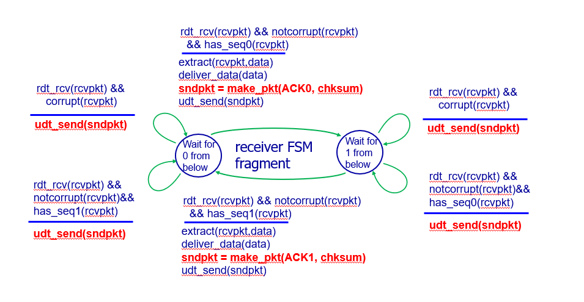

# Homework Week6  
### Mar 21  

Chapter 3  
- P3. UDP and TCP use 1s complement for their checksums. Suppose you have the following three 8-bit bytes: 01010011, 01100110, 01110100. What is the 1s complement of the sum of these 8-bit bytes? (Note that although UDP and TCP use 16-bit words in computing the checksum, for this problem you are being asked to consider 8-bit sums.) Show all work. Why is it that UDP takes the 1s complement of the sum; that is, why not just use the sum? With the 1s complement scheme, how does the receiver detect errors? Is it possible that a 1-bit error will go undetected? How about a 2-bit error?  

- Solution:  
First, add the first two 8-bit bytes. 01010011 + 01100110 = 10111001. Then add the sum and the third 8-bit bytes. 10111001 + 01110100 = 1 00101101. Wrap around the extra bit: 1 + 00101101 = 00101110. Invert all the bits and the checksum is 11010001.   
UDP takes the 1's complement of the sum because  it leads to the mathematically correct way to check for changed bits in a stream of data. But there are some practical reasons too, and the most important is that the UDP checksum, as it is calculated, is endian independent, which makes the processing of checksum faster because one doesn't need to care about swapping bytes.  
The receiver detect errors by adding all the bytes including checksum and observing the sum. If it contains all 1’s then the segment has errors and if it contains 1 or more 0’s then the segment contains errors.  
It is possible to detect all the 1-bit error but some 2-bit errors are undetected.

- P8. Draw the FSM for the receiver side of protocol rdt3.0.  

