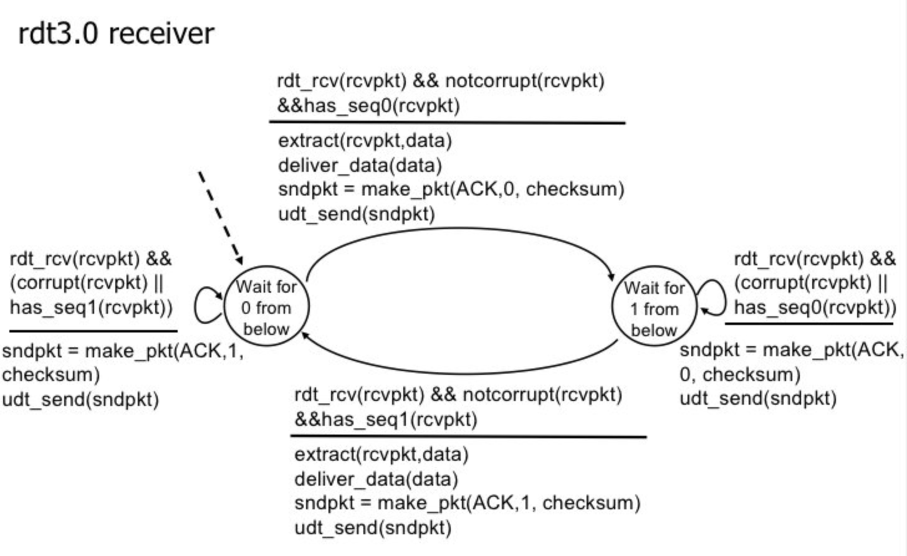

# P3

> UDP and TCP use 1s complement for their checksums. Suppose you have the following three 8-bit bytes: 01010011, 01100110, 01110100. What is the 1s complement of the sum of these 8-bit bytes?(Note that although UDP and TCP use 16-bit words in computing the checksum, for this problem you are being asked to consider 8-bit sums.) Show all work. Why is it that UDP takes the 1s complement of the sum; that is, why not just use the sum? with the 1s complement scheme, how does the receiver detect errors? Is it possible that a 1-bit error will go undetected? How about a 2-bit error?

(1)The given three 8-bit bytes are:
$$
01010011,01100110,01110100
$$
The sum of the first two 8-bit bytes are: 
$$
01010011+01100110 =10111001
$$
Then add the third one:(only get the last 8 bits)
$$
10111001+01110100=100101101
$$
Then wrap around the extra bit because it's overflow:
$$
100101101+1=00101110
$$
The 1s complement is :(Convert all 0’s to 1’s and vice versa to find the 1s compliment.)
$$
11010001
$$
**So the check sum is 11010001.**

(2)

a. **It does not depend on the system is big endian little endian**. That is, whether you are the sender's computer or the receiver to check the checksum, do not call *htons* or *ntohs*, you can get the correct result directly through the above algorithm. You can give an example of this problem yourself. When summing with one’s complement, the byte order of 16 digits is exchanged, and the result is the same, but the byte order is also exchanged accordingly; and if you use the original or complement summation , the results may be different.

b. **It is relatively simple and express to calculate and verify the checksum**.

(3)

**The process of detecting errors by the receiver:**

The receiver performs the following steps at the receiver end to identify the errors in the segment.

- Add all the bytes including checksum.
- Observe the sum.
  - If it contains all 1’s then the segment has errors.
  - If it contains 1 or more 0’s then the segment contains errors.

(4)

**Error types that are identified using 1’s compliment method:**

- Using 1’s compliment method, it is possible to detect all the 1-bit errors.
- Using 1’s compliment method, there is a possibility that some 2-bit errors are left undetected.

# P8

> Draw the FSM for the receiver side of protocol *rdt3.0*

