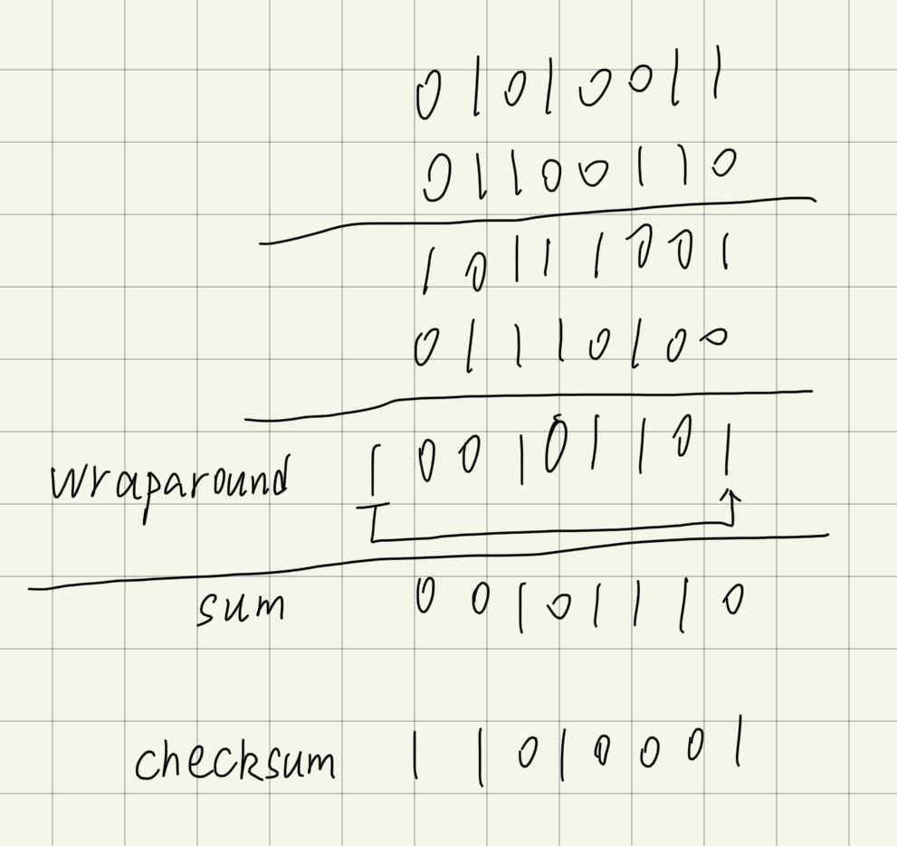

## Week6 Homework

### Chapter 3 Problem 3

**question:**

UDP and TCP use 1s complement for their checksums. Suppose you have the following three 8-bit bytes: 01010011, 01100110, 01110100. What is the 1s complement of the sum of these 8-bit bytes? (Note that although UDP and TCP use 16-bit words in computing the checksum, for this problem you are being asked to consider 8-bit sums.) Show all work. Why is it that UDP takes the 1s complement of the sum; that is, why not just use the sum? With the 1s complement scheme, how does the receiver detect errors? Is it possible that a 1-bit error will go undetected? How about a 2-bit error?

**Answer:**

All work:

To detected if the date is errors, the receiver adds the three 8-bit bytes and the checksum, the result whose any bit is 0 means there has been an error.

It is not possible that a 1-bit error will go undetected.

It is possible that a 2-bit error will go undetected. For example, the first 8-bits byte change to be 01010010 and the second 8-bits byte change to be 01100111. In this case(2-bits error), the error will go undetected.

### Chapter 3 Problem 8

**question:**

Draw the FSM for the receiver side of protocol rdt3.0.

**Answer:**

