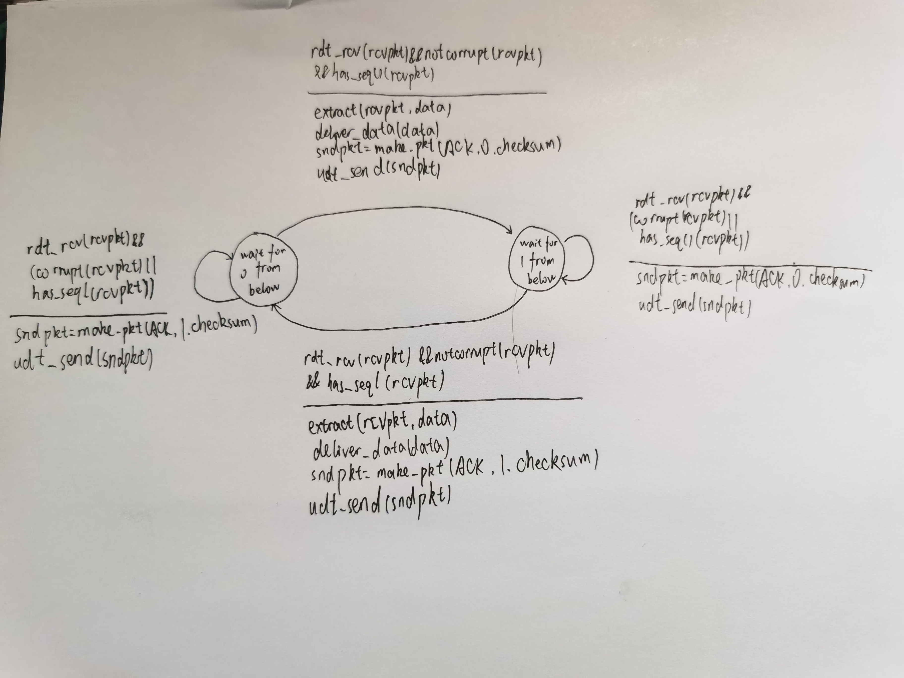

Homework 05 

[TOC]

### Question 01 Chapter 3 Problem 3 

UDP and TCP use 1s complement for their checksums. Suppose you have the following three 8-bit bytes: 01010011, 01100110, 01110100. What is the 1s complement of the sum of these 8-bit bytes? (Note that although UDP and TCP use 16-bit words in computing the checksum, for this problem you are being asked to consider 8-bit sums.) Show all work. Why is it that UDP takes the 1s complement of the sum; that is, why not just use the sum? With the 1s complement scheme, how does the receiver detect errors? Is it possible that a 1-bit error will go undetected? How about a 2-bit error?

answer:

  01010011              10111001

+01100110            +01110100

  10111001              00101110

The base minus one's complement is 11010001. 

If UDP takes the 1s complement of the sum, then it just need to keep adding it up as part of the data and see if it ends up with all 1s.  

But if UDP just use the sum, it need to store sum separately. Finally, the sum of the data is calculated and compared. Storing sum separately requires an extra register.

When one digit of the sum is 0, an error occurs.

A 1-bit error is always detected, but a 2-bit error is not. For example, if the last bit of the first word is converted to 0 and the last bit of the second word is converted to 1.

### Question 02 Chapter 3 Problem 8

Draw the FSM for the receiver side of protocol rdt3.0.

answer:

